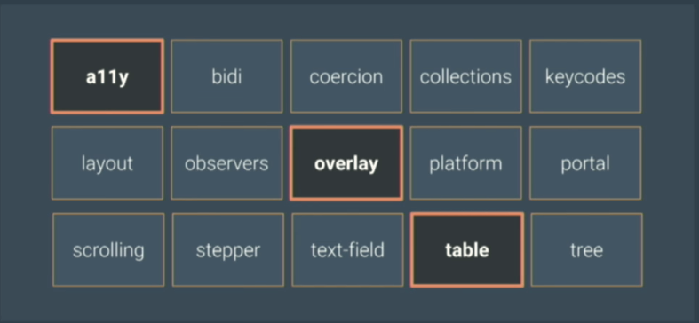

# angular-material

## Part1

1. Initial the application

```bash

npm i @angular/cli@1.7.1 -g

ng new ngmd1

```

2. install angular material

```bash

npm install --save @angular/material @angular/cdk

```

> @angular/cdk in this case stands for component development kit and is just comprising(包含) some general purpose tools that are used for building components which are not directly related to a material design itself but the used bounder materail design library . So we need to install both 

3. install angular animation libary

> On some of the angular design component our making use of advanced transition effects and those transition effects are using another libary which is called angular animations libary and to enable these transition effects in our application we need to install that libary 

```bash
npm install -s @angular/animations

```

* test whether the animation libary work


## Angular CDK

> CDK stands for component dev kit and the main purpose of cdk is to bring tooling for developers particularly component authors to create their own custom components without having to reinvent the wheel for common interaction patterns and behavious . So the cdk start off as the base generic building blocks which we use to make angular material . Over time as those building blocks matures , they reached a point of stability , so we release the cdk as a standalone library , totally sperate from angular material . so the cdk is broken up into mutiple sub packages ,each with an individual responsibility 



> we have just full-blown(完全成熟) components in the cdk for things like table . The table is a good example because it's responsible for the logic of rendering rows of cells that that doesn't have any options on the style .Our angulat material table is just based on top of that with some extra css and the specific behaviors for sorting and pagination that are specific to that design and this make it really usefull for building you own custom experiences . 


